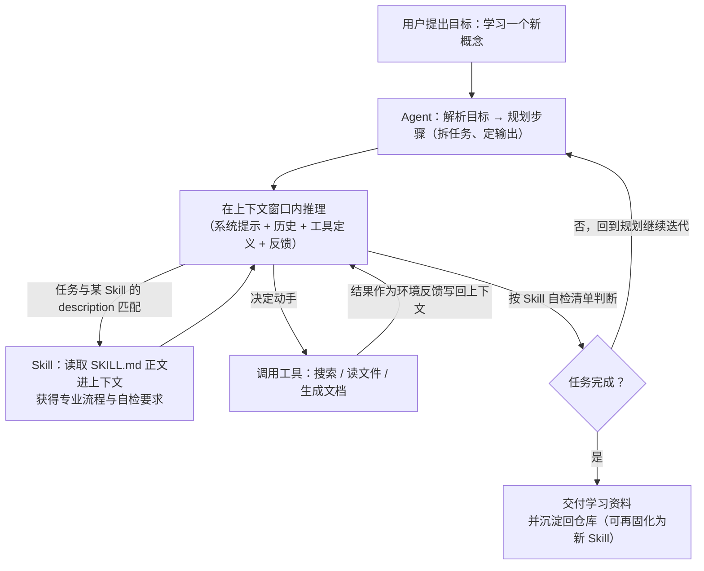
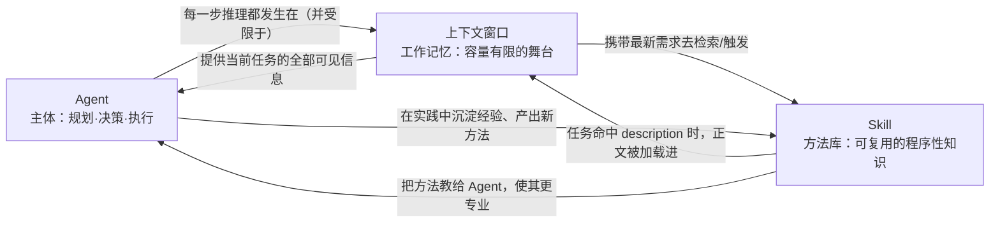

# 概念关系说明：Agent × 大模型的上下文 × Skill

> 本文件是仓库内三份概念学习资料（`agent.html`、`llm-context.html`、`skill.html`）之间的"连接线"。
> 一句话总结：**Agent 是"主体"，上下文是 Agent 的"舞台（工作台）"，Skill 是放在舞台边、需要时自动翻开看的"方法手册"。**

---

## 1. 三者各是什么（对照表）

| 维度 | Agent（智能体） | 大模型的上下文（Context） | Skill（技能） |
|---|---|---|---|
| 本质 | 能自主完成多步任务的**系统/主体** | 模型推理时能参考的**输入总和**（工作记忆） | 可复用的**任务知识与流程包**（目录＋SKILL.md） |
| 角色 | 干活的人 | 干活时摊开的"桌面" | 干活的"岗位手册/菜谱" |
| 关键问题 | 做什么、怎么做、何时停下 | 看得到什么、窗口满没满 | 什么时候被触发、怎么按需加载 |
| 在本作业中的体现 | AI 按我给的流程自动产出资料的过程 | AI 一次只能参考有限对话/文件来完成任务 | `concept-learner/SKILL.md`，把学习方法固化复用 |
| 对应资料 | `agent.html` | `llm-context.html` | `skill.html` |

---

## 2. 关系图一：一次任务中三者如何协作

**读图要点**：整条链路上，Agent 每做一次决策都要"看上下文"；Skill 的作用是**在恰当的时机把专业做法送进上下文**；工具结果也先进上下文再影响下一步。可以说：**没有上下文，Agent 寸步难行；没有 Skill，Agent 只能凭通用能力"即兴发挥"。**

---

## 3. 关系图二：三者之间的依赖关系

- 实线关系①：**Agent ⇄ 上下文** —— Agent 依赖上下文获取任务信息；上下文容量与质量反过来限制 Agent 的表现。
- 实线关系②：**上下文 ⇄ Skill** —— Skill 平时只占极少量上下文（元数据），命中时才把正文装入；装入后该内容即刻成为上下文的一部分。
- 实线关系③：**Agent ⇄ Skill** —— Agent 使用 Skill 完成任务，也可把新学到的做法沉淀成新 Skill，形成"越用越强"的正循环。

---

## 4. 重点一：上下文如何影响 Agent 的工作

1. **上下文是 Agent 唯一的"眼前世界"**。Agent 没有"直觉"之外的实时感知，它关于任务的全部事实都来自上下文：系统提示里的规则、对话历史、工具返回。Anthropic 称之为模型的 working memory。
2. **窗口有限 → Agent 必须做"上下文管理"**：
   - 工具结果、读入的文档都会累积占用窗口；长任务里 Agent 要学会**挑着读、先总结再继续**，否则会"忘记"早期指令。
   - 窗口快满时靠 **截断 / 压缩（compaction）** 腾空间；重要结论要放在显眼位置（研究显示长上下文的"中间部分"最容易被忽略）。
3. **内容质量比长度更重要**：塞得越多越容易出现 **context rot**（精度与召回下降）。所以优秀 Agent 的设计往往配合检索（RAG）与精简工具集——**决定 Agent 上限的，不只是模型，还有"工作台上摆了什么"**。
4. **反面教材**：如果给 Agent 塞入超大且无关的上下文，它会变慢、变贵、变糊涂；这正是"上下文管理"成为 Agent 工程核心话题的原因。

---

## 5. 重点二：Skill 如何沉淀可复用的任务知识

1. **把"怎么做"从对话里解放出来**：普通 Prompt 是一次性口信，说完就丢；Skill 把流程写进文件（SKILL.md + 可选脚本/模板），随仓库用 git 管理，可跨会话、跨任务、跨平台复用。
2. **渐进式披露，控制上下文开销**：只有 `name` + `description`（约百 token）常驻；正文与资源在任务命中后才加载。这让"装很多 Skill"不会显著挤占上下文——**Skill 本身就是一种上下文管理手段**。
3. **沉淀的是"程序性知识"而非"事实"**：事实资料（大量文档）应放 Skill 的第三级资源按需读取；正文只写"怎么做、注意什么、如何自检"。
4. **学习闭环**：本次我先把"概念学习法"沉淀为 `concept-learner`，再让它生成三份资料——**方法 → 产物 → 仓库**，产物反过来又成为未来学习（如 MCP、RAG）的上下文素材，形成个人知识资产。

---

## 6. 三者合起来看（本次作业的完整故事）

> 我（用户）是"老板"，给出目标；**Agent** 是替我干活并会自我检查的"执行者"；**上下文**是它每次动脑时眼前那张有限的"工作台"；**Skill** 是我写给它的"标准作业手册"，它一遇到"学概念"这类任务就自动翻开手册照做。手册越写越好（沉淀），工作台摆得越精（管理），执行者就越靠谱（Agent）。三者互相成就，缺一不可。

---

## 7. 说明与核查

- 本文件的三处 Mermaid 图在 GitHub 上会自动渲染；在本地可用 VS Code 插件或 [mermaid.live](https://mermaid.live/) 预览。
- 核心论断（"上下文是工作记忆/会 context rot""Skill 渐进式披露/元数据常驻"等）分别与三份资料中已核实的官方来源一致，详见各 HTML 的"资料来源"章节。
- 本文件由项目级 Skill `concept-learner` 所沉淀的学习法配套维护（2026-09-07 初稿，2026-09-08 统一 Skill 名称引用），核心论断已通读校对。
